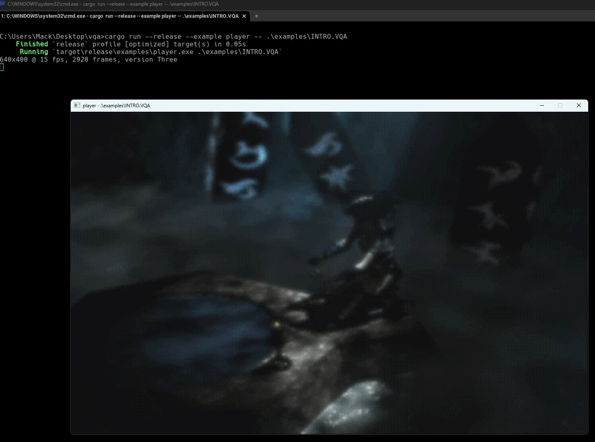

# vqa

[](https://github.com/smackysnacks/vqa-parser/actions/workflows/rust.yml)
[](https://crates.io/crates/vqa)
[](https://docs.rs/vqa)
[](LICENSE)

A parser and decoder for Westwood Studios' VQA (Vector Quantized Animation)
format — the full-motion-video format of Westwood's 90s games, including
Command & Conquer, Red Alert, Lands of Lore, Dune 2000, Blade Runner,
Tiberian Sun, and Nox.



## Format support

| Area      | Coverage                                                                                        |
|-----------|-------------------------------------------------------------------------------------------------|
| Container | All three versions (v1–v3), both 8-bit and HiColor movies                                        |
| Video     | 8-bit palettized (`VPT?` pointer tables) and 15-bit HiColor (`VPTR`/`VPRZ` command streams, including the Blade Runner alpha-skip commands) |
| Audio     | IMA ADPCM (`SND2`) and raw PCM (`SND0`); Westwood ADPCM (`SND1`, early 8-bit-audio movies) is not supported yet |

Malformed input fails with an error rather than panicking, and allocation
sizes taken from the file are capped, so the crate is safe to run on
untrusted data (see `fuzz/`).

## Quick start

```rust
use vqa::VQA;

fn main() -> Result<(), Box<dyn std::error::Error>> {
    let data = std::fs::read("movie.vqa")?;
    let vqa = VQA::parse(&data)?;

    let header = &vqa.header;
    println!(
        "{}x{}, {} frames at {} fps",
        header.width, header.height, header.num_frames, header.frame_rate
    );

    // The video, frame by frame
    for frame in vqa.frames()? {
        let rgb = frame?.to_rgb888(); // packed RGB bytes, row-major
    }

    // The soundtrack, as interleaved signed 16-bit PCM
    if header.has_sound() {
        let samples = vqa.decode_audio()?;
    }
    Ok(())
}
```

For consumers that want to walk the container themselves, the `parser`
module exposes zero-copy [nom](https://crates.io/crates/nom) parsers for
every chunk type, with `lcw` (LCW/"Format80" decompression), `video`
(`FrameDecoder`), and `audio` (IMA ADPCM) as the decoding layers underneath.
See the [API docs](https://docs.rs/vqa) for the full tour.

## Examples

Three runnable examples exercise the high-level API, using the bundled
`examples/wwlogo.vqa` sample movie:

```sh
# Play a movie in a window (video + audio; Space pauses, Esc/Q quits)
cargo run --release --example player -- examples/wwlogo.vqa 2
# or: just play examples/wwlogo.vqa

# Play just the soundtrack
cargo run --release --example play -- examples/wwlogo.vqa

# Dump every video frame as PPM
cargo run --release --example dump_frames -- examples/wwlogo.vqa out/
```

The examples' audio/video output uses [cpal](https://crates.io/crates/cpal)
and [minifb](https://crates.io/crates/minifb) (dev-dependencies only; on
Linux, cpal needs the ALSA headers, e.g. `libasound2-dev`).

## Format documentation

The `doc/` directory of the repository carries the format references this
crate is written against: `vqa.txt` for v1/v2, `hc-vqa.txt` for the HiColor
scheme, and `ima-adpcm.txt` for the audio codec.

## License

MIT - see [LICENSE](LICENSE).
